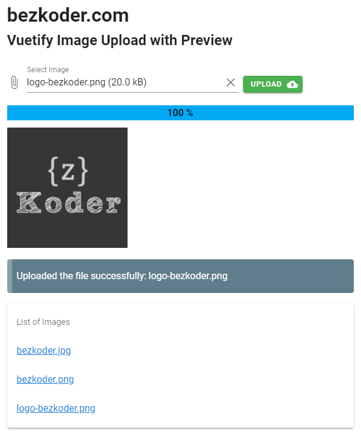

# Vuetify Image Upload with Preview example
Build Vuetify upload image with Preview and Progress Bar example, using Axios to upload image to server (Rest API).

For more details, please visit:
> [Vuetify Image Upload with Preview tutorial](https://bezkoder.com/vuetify-image-upload-preview/)

Rest APIs server for this Vue Client:
> [Node.js Express File Upload Rest API example](https://bezkoder.com/node-js-express-file-upload/)

> [Node.js Express File Upload with Google Cloud Storage example](https://bezkoder.com/google-cloud-storage-nodejs-upload-file/)

> [Spring Boot Multipart File upload example](https://bezkoder.com/spring-boot-file-upload/)

More Practice:
> [Vuetify Multiple Images Upload example with Progress Bar](https://bezkoder.com/vuetify-multiple-image-upload/)

> [Vuetify CRUD App example | v-data-table](https://bezkoder.com/vuetify-data-table-example/)

> [Vuetify Pagination (Server Side) example](https://bezkoder.com/vuetify-pagination-server-side/)

Fullstack CRUD App:
> [Vue.js + Node.js + Express + MySQL](https://bezkoder.com/vue-js-node-js-express-mysql-crud-example/)

> [Vue.js + Node.js + Express + PostgreSQL](https://bezkoder.com/vue-node-express-postgresql/)

> [Vue.js + Node.js + Express + MongoDB](https://bezkoder.com/vue-node-express-mongodb-mevn-crud/)

> [Vue.js + Spring Boot + Embedded Database example](https://bezkoder.com/spring-boot-vue-js-crud-example/)

> [Vue.js + Spring Boot + MySQL example](https://bezkoder.com/spring-boot-vue-js-mysql/)

> [Vue.js + Spring Boot + PostgreSQL example](https://bezkoder.com/spring-boot-vue-js-postgresql/)

> [Vue.js + Spring Boot + MongoDB](https://bezkoder.com/spring-boot-vue-mongodb/)

> [Vue.js + Django Rest Framework](https://bezkoder.com/django-vue-js-rest-framework/)

Integration (run back-end & front-end on same server/port)
> [Integrate Vue App with Spring Boot](https://bezkoder.com/integrate-vue-spring-boot/)

> [Integrate Vue App with Node.js Express](https://bezkoder.com/serve-vue-app-express/)

Serverless with Firebase:
> [Vue Firebase Realtime Database: CRUD example](https://bezkoder.com/vue-firebase-realtime-database/)

> [Vue Firestore CRUD example](https://bezkoder.com/vue-firestore-crud/)
